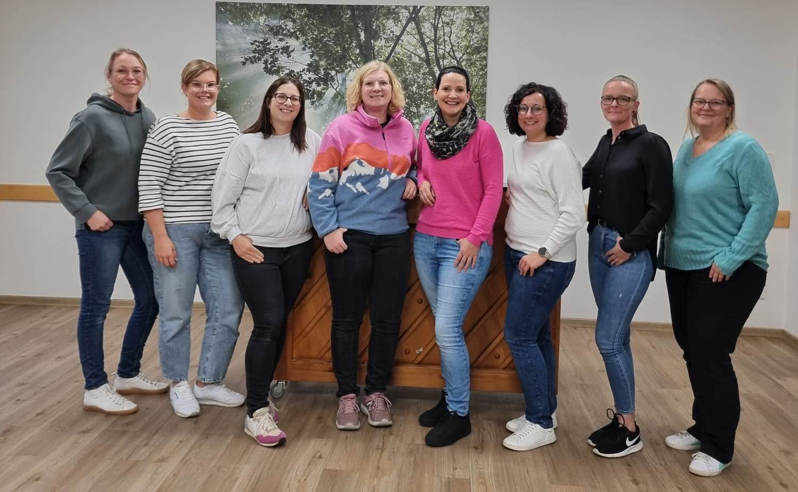

+++
date = '2024-11-01T18:09:24+01:00'
draft = false
title = 'Babybörse Meerhof'
+++
# Babybörse Meerhof – knapp 25 Jahre ehrenamtliches Engagement für einen guten Zweck

Es begann als kleine Idee, damals im Jahr 2000, als die damaligen Teilnehmerinnen der Krabbelgruppe Meerhof, wie zum Beispiel Gabi Rasche und Birgit Lülfs, nach zahlreichen Besuchen auf den Börsen im Umkreis dachten: „Das können wir auch!“.

Man wollte Eltern eine Gelegenheit bieten, eigene Sachen weiterzugeben und selbst günstig Gebrauchtes zu erstehen. Da die Krabbelgruppe eh schon der kfd als Untergruppe angegliedert war und das Pfarrheim als Treffpunkt diente, entschloss man sich besagten Ort auch als ersten Veranstaltungsort zu nutzen. 

Am 10.September 2000 fand dann die erste Babybörse statt. Während der ersten Börsen konnte man sich als Verkäufer noch entscheiden, ob man seine Ware an einem eigenen Verkaufsstand anbieten oder die Sachen mit in das nach Warengruppen und –größen sortierte Angebot übergeben möchte. Doch im Laufe der Zeit hat sich die zweite Variante durchgesetzt und wird bis zum heutigen Tag auch noch so durchgeführt. 

2004 entschied die Gruppe der anfänglichen Organisatorinnen sich in „Rappelkiste“ umzubenennen. Der Erfolg der Börsen zeigte sich durch die immer größer werdende Anzahl der interessierten Anbieter. Die Räume des Pfarrheims reichten bei der Menge an Baby- und Kinderartikeln bald nicht mehr aus. Und so zog man circa 2005 in den damaligen Anbau der alten Schule, um der stetig ansteigenden Zahl der Verkäufer gerecht zu werden und den Waren ausreichenden und übersichtlichen Platz zu bieten. Im Jahr 2006 übernahmen die „Sintfeldkinder“ die Organisation der Veranstaltung und im weiteren Verlauf wurde die Börse in die Schützenhalle verlegt. 

Seit der Gründung der Babybörse hat sich einiges verändert, wie z.B. der Veranstaltungsort, die Angliederung an den Klassengeist e.V. (auf Grund der Auflösung der kfd Meerhof), die Anzahl der Verkäufer (2000 waren es 17 und bei der letzten Börse 2024 70 Verkäufer) und die Art der Werbung. Hat man früher noch Handzettel genutzt, wird heute aktiv über Social Media kommuniziert.

Gleich geblieben ist einmal die Art der angebotenen Artikel (Kleidung, Schuhe, Spielsachen, Grundausstattungsbedarf wie Kinderwagen, Autositze, Schwangerschaftsmode etc.), das umfangreiche Angebot an Kuchen und Torten sowie der 3-fach Nutzen:  Familien haben die Möglichkeit günstig Kinderkleidung zu erwerben während gleichzeitig Ressourcen geschont und nachhaltiges Handeln gefördert wird. Darüber hinaus kommt der Erlös der Börse dem Ort wieder in vielfältiger Weise zugute, denn das eingenommene Geld durch die Verkäuferprovisionen und dem Kuchenverkauf wird im Anschluss lokalen Projekten, Vereinen und Einrichtungen gespendet, die für und mit Kindern arbeiten. 

Um hier nur einiges zu nennen: 

- Rutsche für das Außengelände des Kindergartens Wirbelwind 
- Neue Küchenzeile im Pfarrheim 
- Stutenkerle an St. Martin für Meerhof und Blankenrode über mehrere Jahre
- Wickeltisch in der Alten Schule
- Bücher und Handpuppen für den Kindergarten Wirbelwind
- Instrumente für die musikalische Früherziehung der Musikkapelle Meerhof
- Anschaffung von Spielzeugkiste und Spielzeug auf dem alten Schulhof
- Spende an die Flüchtlingshilfe
- Beitrag für einen „Menschenkicker“ zum Sommerfest der Egge-Diemel Grundschule Westheim

### Wie ist der grobe Ablauf einer Babybörse aus Verkäufersicht?
Angemeldete Verkäufer bringen den Freitag vor der Börse am frühen Abend ihre Waren in die Schützenhalle, ausgezeichnet mit Verkäufernummer, Preis sowie Größe. Die nicht verkaufte Ware wird vom Helferteam direkt nach Beendigung der Börse wieder in die jeweiligen Verkäuferkisten geräumt; der Verkäufer erhält seinen Umsatz noch bei Abholung der Ware am Samstagabend.

Um den Ablauf der Börse für die Verkäufer so unkompliziert wie oben beschrieben zu gewährleisten und diese überhaupt zweimal im Jahr auf die Beine stellen zu können, bedarf es einer großen Anzahl an Helfern. 

Einmal das engere Organisationsteam welches sich im Vorfeld um die Terminfindung, Versendung von Einladungen und Informationen, Erstellung der Plakate, Schaltung von Werbung, Organisation von Helfern und Kuchenspenden, Planung des Ablaufes etc. kümmert.
Und nicht zu vergessen die unentbehrlichen Helfer welche Verkaufsstände aufbauen, die gebrachten Waren nach Warengruppen und Größen verräumen, während der Börse die Artikel im Blick haben und am Ende der Börse die Waren von den einzelnen Tischen in die Kisten der jeweiligen Verkäufer sortieren. Dann alles wieder abbauen, so dass die Schützenhalle im Ursprungszustand verlassen werden kann.  Hier gilt es schnell zu sein, denn zu einer festgelegten Zeit stehen die Verkäufer zur Abholung ihrer Waren bereit.  

Als Belohnung für die tatkräftige Unterstützung an beiden Tagen wird Helfern die Provision erlassen, welche ansonsten auf ihren Umsatz erhoben wird. 

Getreu dem Motto „Viele Hände, schnelles Ende“ freut sich das Organisationsteam jederzeit über neue Helfer, um die langjährige Tradition der Babybörse fortführen zu können und noch viele weitere Projekte und Einrichtungen für Kinder zu unterstützen.
Bei Interesse folgt dem QR-Code für die WhatsApp Gruppe, in der alle Informationen mitgeteilt werden und man so immer auf dem neusten Stand ist.

