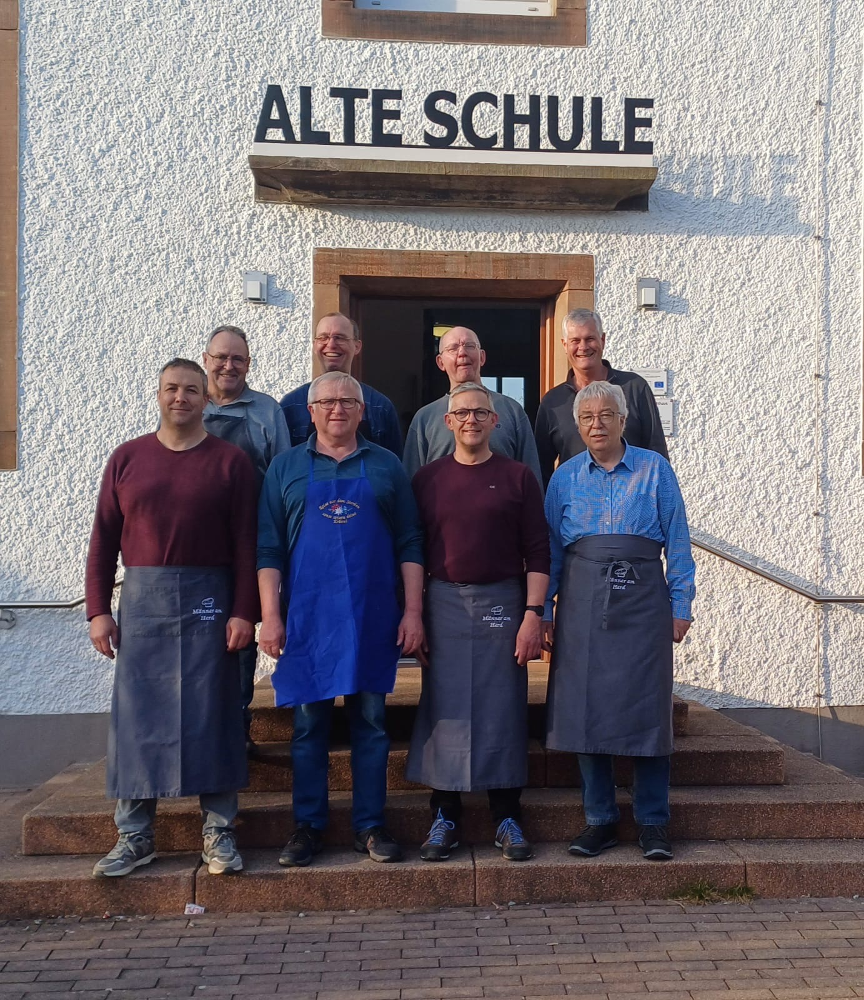
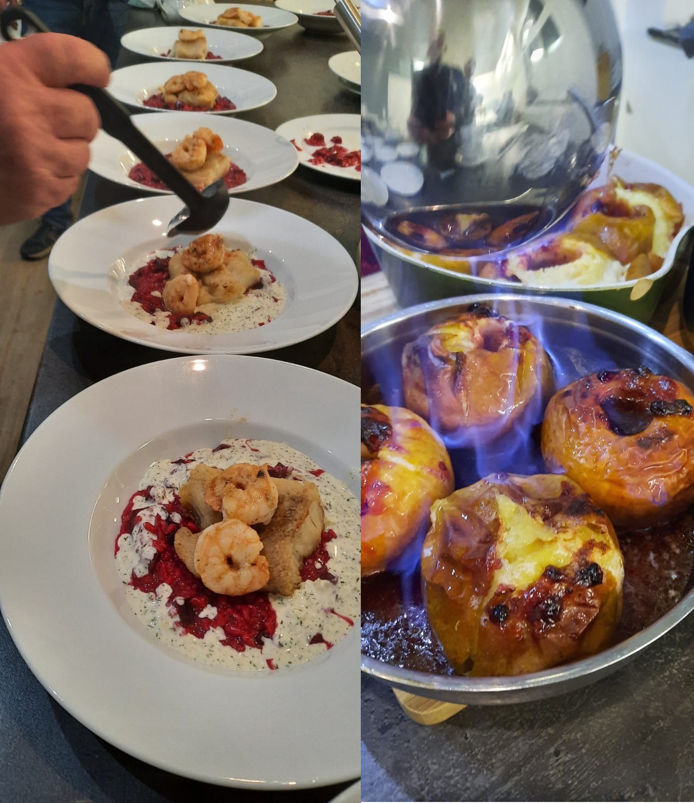

+++
date = '2024-11-01T18:09:24+01:00'
draft = false
title = 'Männer am Herd'
weight = 3
+++
# Männer am Herd

Aus einer Bierlaune heraus entstand vor einigen Jahren ein Männerkochclub. Zunächst kochten die vier Gründungsmitglieder in den Anfängen noch am heimischen Herd. Mangels einer geeigneten Location schlief der Kochclub nach einiger Zeit jedoch wieder ein. Mit Fertigstellung unseres Dorfgemeinschaftshauses der "Alten Schule" samt Kücheneinbau wurde die Idee vor rund zehn Jahren wiederbelebt. Seitdem finden sich regelmäßig an jedem ersten Freitag im Monat um 18:30 Uhr ein Kreis Männer in der "Alten Schule" ein, deren gemeinsame Leidenschaft das Kochen und gutes Essen ist. 

Anfangs wurden die Menüs noch vom Gründungsmitglied Wolfgang Meyer zusammengestellt, der auch das für die Zubereitung erforderliche Equipment aus dem eigenen Bestand mitbrachte. Mit den Jahren haben die "Männer am Herd" gewonnen: an Erfahrung, Kochkompetenzen und auch Ausrüstung. Es werden keine Töpfe mehr geschleppt (lediglich ein Schneidebrett und ein scharfes Messer sind noch immer zum Kochen mitzubringen) und reihum ist jeder einmal für die Auswahl des Menüs (drei bis vier Gänge), sowie den Einkauf der notwendigen Lebensmittel zuständig. Gekocht wird alles, was schmeckt oder spannend klingt: von Algensalat über saftigen Kirsch-Clafouti bis zur Zwiebeltorte. Reste gibt es selten und Alles, was für gut befunden wird, wird auch zu Hause ausprobiert. 

Wer also Freitags Abends herrliche Düfte aus der "Alten Schule" wahrnimmt, kann davon ausgehen, dass die "Männer am Herd" den Kochlöffel schwingen.

