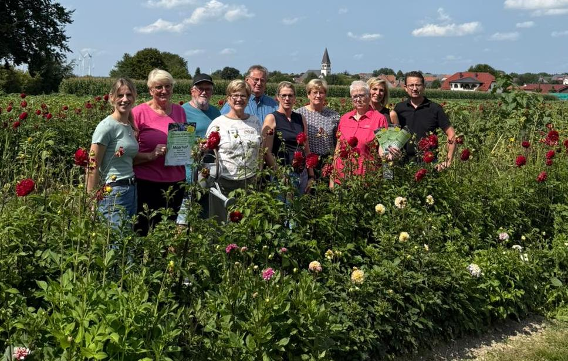

+++
date = '2024-11-01T18:09:24+01:00'
draft = false
title = 'Team Grün'
weight = 2
+++
# Team Grün

Aus der Idee, zur Verschönerung des Dorfes beizutragen, ist im Rahmen einer Bürgerumfrage 2011 aus ca. 6-8 Gründungsmitgliedern das "Team Grün" entstanden. Es wurden Beete vor den Dorfeingängen, der Kirche und am Ehrenmal, sowie an kleineren, etwas verwaisten Flächen in öffentlichem Eigentum angelegt. Mittlerweile besteht das Team Grün aus etwa 20 gartenbegeisterten Menschen, die mit viel Engagement die Beete im Jahresverlauf pflegen und gestalten. Grundidee bei der Anlage der Beetflächen ist die Nachhaltigkeit. So werden, wann immer möglich, Stauden und mehrjährige Pflanzen für die Gestaltung der Beete ausgewählt.

Neben diesen regelmäßigen Arbeitseinsätzen im Beet haben die Mitglieder des "Team Grün" im Laufe der letzten Jahre schon etliche Veranstaltungen für die Dorfgemeinschaft und auch Gäste aus den umliegenden Ortschaften organisiert. So gab es bereits im Jahr 2014 den 1. "Tag des offenen Gartens", eine Staudenbörse im Jahr 2015, einen 2. Gartentag im Jahr 2017, einen Dorfflohmarkt 2019 und einen 3. Gartentag im Jahr 2025. Auch für die blühende Dekoration des Dorfes und des Festgeländes anlässlich des Kreisschützenfestes 2025 waren die  Mitglieder des "Team Grün" mit viel Einsatz und kreativen Ideen verantwortlich.   

Für die aktiven Mitglieder organisiert "Team Grün" regelmäßig Tagesausflüge in Schaugärten. Hier gibt es dann neben Austausch und gemütlichem Beisammensein auch wieder neue Ideen zum Thema Gärtnern, Pflanzen und Dekoration.